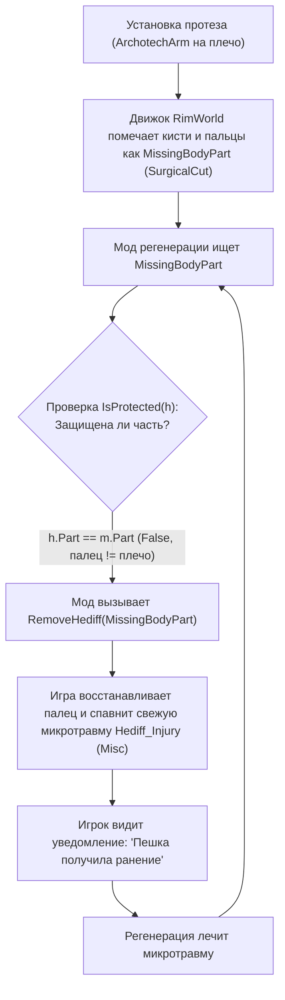

# Диагностика сохранений RWS и отладка системы здоровья пешек

Данное руководство посвящено низкоуровневой диагностике файлов сохранений RimWorld (`.rws`), исследованию скрытых проблем здоровья пешек (`Pawn_HealthTracker`), анализу иерархии анатомии (`BodyDef`), а также разбору типичных ошибок моддинга при реализации механик регенерации и протезирования.

---

## 1. Анатомическая модель RimWorld и система Hediffs

В RimWorld физическое состояние существ моделируется через дерево частей тела (`BodyDef`) и список наложенных на них эффектов (`HediffSet`).

### Иерархия частей тела (Родитель → Дочерние части)
Анатомия человека (`Bodies_Humanlike.xml`) представляет собой строгое иерархическое дерево:
```text
Torso (Торс)
 └── Shoulder (Плечо)
      └── Clavicle (Ключица)
      └── Arm (Рука)
           └── Humerus (Плечевая кость)
           └── Radius (Лучевая кость)
           └── Hand (Кисть)
                ├── Pinky (Мизинец)
                ├── Ring finger (Безымянный палец)
                ├── Middle finger (Средний палец)
                ├── Index finger (Указательный палец)
                └── Thumb (Большой палец)
```

### Классификация состояний здоровья (`Hediff`)

1. **`Hediff_AddedPart` (Искусственная замена / Протез)**:
   * Заменяет собой целевую часть тела (например, `ArchotechArm` на `Shoulder` или `Arm`).
   * **Ключевой механизм движка**: При установке `AddedPart` на родительскую часть тела все её дочерние естественные узлы (кисть, кости, пальцы) **автоматически удаляются** и получают скрытый статус `Hediff_MissingPart` с пометкой `<lastInjury>SurgicalCut</lastInjury>`. Это нормальное ванильное поведение: пальцы физически отсутствуют, так как рука заменена цельным кибернетическим протезом.
2. **`Hediff_Implant` (Вживляемый имплант)**:
   * Устанавливается внутрь части тела без её удаления (например, `HealingEnhancer`, `SkeletalBracing`, `MedicalRib`). Дочерние части сохраняются.
3. **`Hediff_MissingPart` (Утраченная часть тела)**:
   * Фиксирует факт потери части тела (в бою, при обморожении или при хирургической ампутации).
4. **`Hediff_Injury` (Ранение / Травма)**:
   * Конкретное повреждение ткани (`severity` — количество урона, `def` — тип ранения: `Scratch`, `Bite`, `Gunshot`, `Misc` и т.д.).

---

## 2. Структура файла сохранения (`.rws`)

Файл сохранения RimWorld — это XML-документ с корневым тегом `<savegame>`.

### 1. Метаданные и список модов (`/savegame/meta`)
Позволяет проверить точный состав и порядок загрузки модов конкретного сейва:
```xml
<meta>
  <gameVersion>1.6.4150</gameVersion>
  <modNames>
    <li>Harmony</li>
    <li>Core</li>
    <li>Royalty</li>
    ...
  </modNames>
  <modIds>
    <li>brrainz.harmony</li>
    <li>ludeon.rimworld</li>
    ...
  </modIds>
</meta>
```

### 2. Игровое время и тики (`/savegame/game/tickManager`)
* **`ticksGame`** — абсолютное время игры в тиках ($60\text{ тиков} = 1\text{ секунда}$, $2500\text{ тиков} = 1\text{ игровой час}$, $60000\text{ тиков} = 1\text{ игровые сутки}$).
* Сравнение `ticksGame` с временем получения травмы позволяет вычислить точную секунду возникновения бага.

### 3. Данные о здоровье колониста (`/savegame/game/maps/li/things/thing`)
Пешки на карте размещаются внутри списка объектов карты `<things>`. Каждая пешка (`<thing Class="Pawn">` или `<def>Human</def>`) содержит блок `<healthTracker>`:
```xml
<healthTracker>
  <hediffSet>
    <hediffs>
      <!-- Протез плеча/руки -->
      <li Class="Hediff_AddedPart">
        <def>ArchotechArm</def>
        <part>
          <body>Human</body>
          <index>23</index>
        </part>
        <severity>0.5</severity>
      </li>

      <!-- Автоматически ампутированная кисть под протезом -->
      <li Class="Hediff_MissingPart">
        <loadID>1471</loadID>
        <def>MissingBodyPart</def>
        <part>
          <body>Human</body>
          <index>28</index>
        </part>
        <lastInjury>SurgicalCut</lastInjury>
      </li>

      <!-- Ранение на отдельной части тела -->
      <li Class="Hediff_Injury">
        <loadID>1669</loadID>
        <ageTicks>1566</ageTicks>
        <tickAdded>158071</tickAdded>
        <visible>True</visible>
        <severity>6.37048531</severity>
        <def>Misc</def>
        <part>
          <body>Human</body>
          <index>31</index>
        </part>
      </li>
    </hediffs>
  </hediffSet>
</healthTracker>
```

---

## 3. Архитектурный разбор бага «Фантомные травмы» (Phantom Injury Loop)

### Суть проблемы
Игрок сталкивается с тем, что полностью здоровые колонисты во время обычной работы (исследования, сон, переноска) неожиданно получают ранения пальцев, кистей или плеч без внешнего воздействия, а игра спавнит сообщения о травмах.



### Разбор C#-ошибки в коде мода (на примере `HediffComp_MechlordRegeneration`)
```csharp
// ОШИБКА: Проверяется только равенство текущей части тела
Hediff_MissingPart val3 = Pawn.health.hediffSet.hediffs
    .OfType<Hediff_MissingPart>()
    .FirstOrDefault(m => !Pawn.health.hediffSet.hediffs.Any(h => h != m && h.Part == m.Part && IsProtected(h)));

if (val3 != null)
{
    Pawn.health.RemoveHediff(val3); // Удаляет MissingPart со скрытого пальца!
}
```

### Почему это приводит к травме?
В ванильной логике `Pawn_HealthTracker`, когда `Hediff_MissingPart` удаляется у пешки с живой плотью, восстанавливаемая часть тела спавнится с минимальным запасом очков прочности и остаточным ранением (`Hediff_Injury` с дефом `Misc`), которое должно постепенно зажить. Мод регенерации заживляет этот палец, на следующем цикле видит следующий «отсутствующий» палец внутри протеза, снова пытается его восстановить — и цикл повторяется бесконечно для всех 10 пальцев обеих рук.

### Корректная реализация проверки для разработчиков модов:
Для безопасного восстановления частей тела необходимо рекурсивно проверять родителей узла анатомии:
```csharp
public static bool IsPartOrAncestorReplaced(Pawn pawn, BodyPartRecord part)
{
    BodyPartRecord current = part;
    while (current != null)
    {
        // Если на самой части или любом её предке (рука, плечо) стоит AddedPart
        if (pawn.health.hediffSet.hediffs.Any(h => h.Part == current && h is Hediff_AddedPart))
        {
            return true;
        }
        current = current.parent;
    }
    return false;
}
```

---

## 4. Скрипты диагностики сохранений (PowerShell)

При возникновении трудноуловимых симптомов используйте следующие сценарии PowerShell:

### Скрипт 1: Полный аудит здоровья и ранений всех пешек
```powershell
[Console]::OutputEncoding = [System.Text.Encoding]::UTF8
$savePath = (Get-ChildItem "$env:USERPROFILE\AppData\LocalLow\Ludeon Studios\RimWorld by Ludeon Studios\Saves\*.rws" | Sort-Object LastWriteTime -Descending | Select-Object -First 1).FullName
[xml]$xml = Get-Content $savePath

$humans = $xml.savegame.game.maps.li.things.thing | Where-Object { $_.def -eq 'Human' }
foreach ($p in $humans) {
    Write-Host "========================================="
    Write-Host "ПОСЕЛЕНЕЦ: $($p.name.first) '$($p.name.nick)' $($p.name.last) (ID: $($p.id))"
    Write-Host "========================================="
    foreach ($h in $p.healthTracker.hediffSet.hediffs.li) {
        $part = if ($h.part) { "PartIndex: $($h.part.index)" } else { "ВЕСЬ ОРГАНИЗМ" }
        $class = if ($h.Class) { $h.Class } else { "Normal" }
        $sev = if ($h.severity) { " (Урон/Тяжесть: $($h.severity))" } else { "" }
        Write-Host "  -> [$class] $($h.def)$sev на [$part]"
    }
}
```

### Скрипт 2: Сопоставление времени ранений с игровыми тиками
```powershell
[Console]::OutputEncoding = [System.Text.Encoding]::UTF8
$savePath = (Get-ChildItem "$env:USERPROFILE\AppData\LocalLow\Ludeon Studios\RimWorld by Ludeon Studios\Saves\*.rws" | Sort-Object LastWriteTime -Descending | Select-Object -First 1).FullName
[xml]$xml = Get-Content $savePath

$currentTicks = [int64]$xml.savegame.game.tickManager.ticksGame
Write-Host "Текущий тик игры: $currentTicks"

$injuries = $xml.SelectNodes('//li[@Class="Hediff_Injury"]')
foreach ($inj in $injuries) {
    $tickAdded = [int64]$inj.tickAdded
    $diffSec = ($currentTicks - $tickAdded) / 60
    Write-Host "Ранение: $($inj.def) | Нанесено на тике: $tickAdded ($([math]::Round($diffSec, 1)) сек. назад) | Урон: $($inj.severity)"
}
```

---

## 5. Выводы и регламент действий при отладке

1. **Если раны возникают при отсутствии врагов/опасностей**:
   * Проверить комбинацию установленных модов на регенерацию/бессмертие и бионических протезов конечностей.
   * Проверить индексы частей тела в `<healthTracker>` — если травмы приходятся на пальцы (`Finger`) и кисти (`Hand`) при установленных протезах рук (`ArchotechArm`), источник проблемы — неполноценный алгоритм поиска `Hediff_MissingPart`.
2. **Очистка последствий в сохранении**:
   * При отключении проблемного мода уже нанесенные раны остаются в XML-файле сохранения и требуют разового медицинского заживления в игре. Новые раны после ликвидации скрипта перестают генерироваться.
